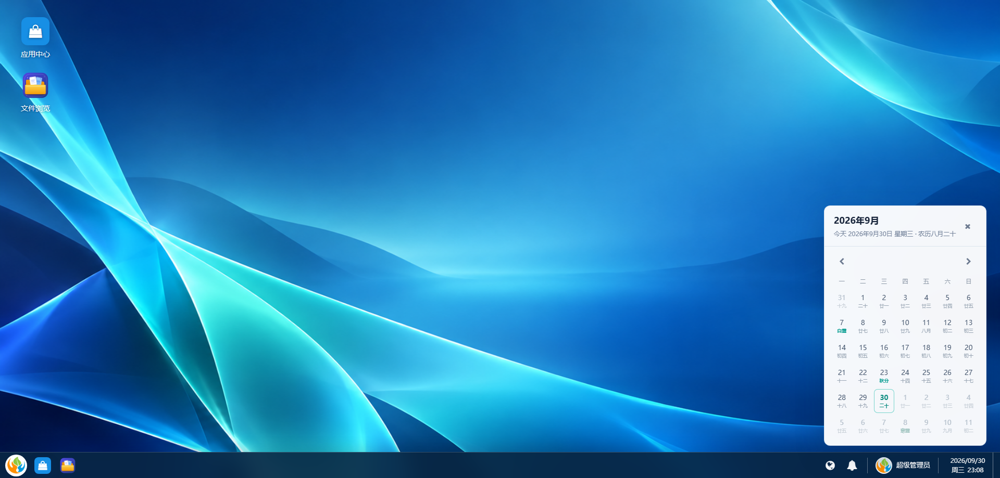
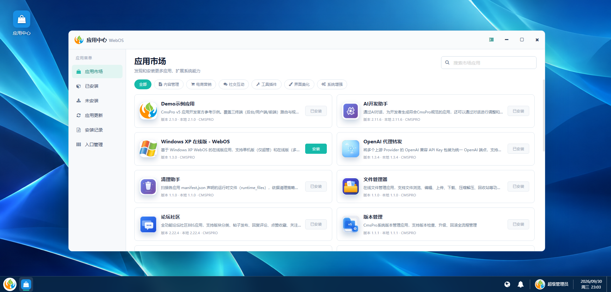
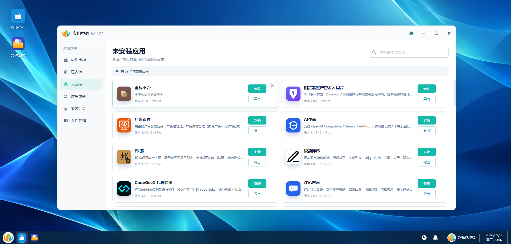
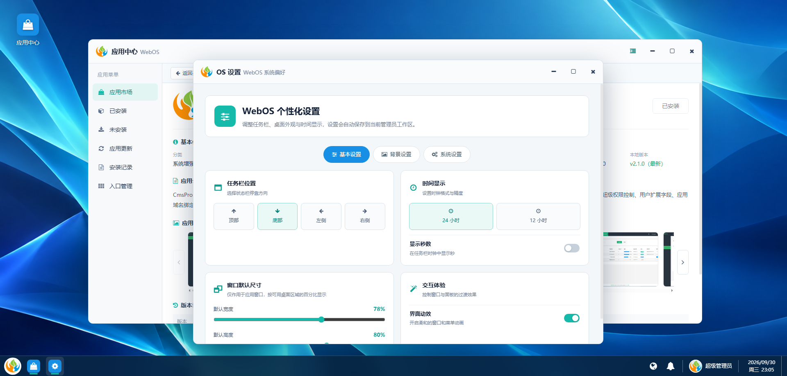
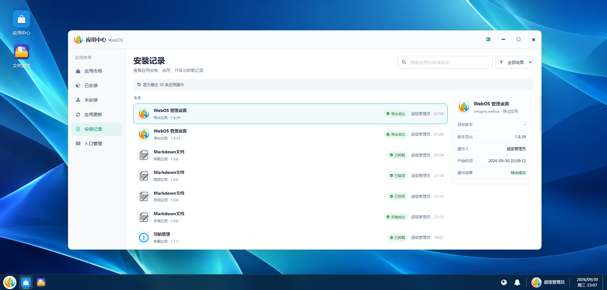
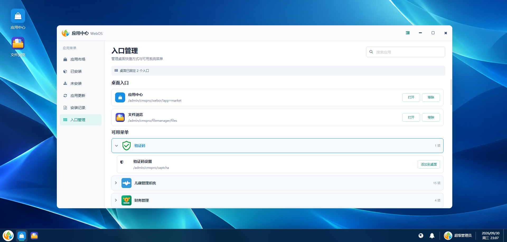
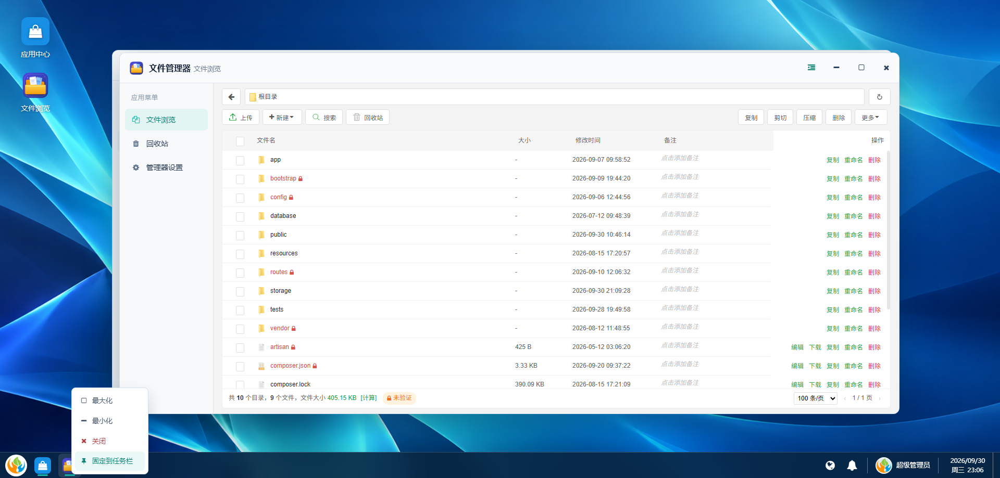
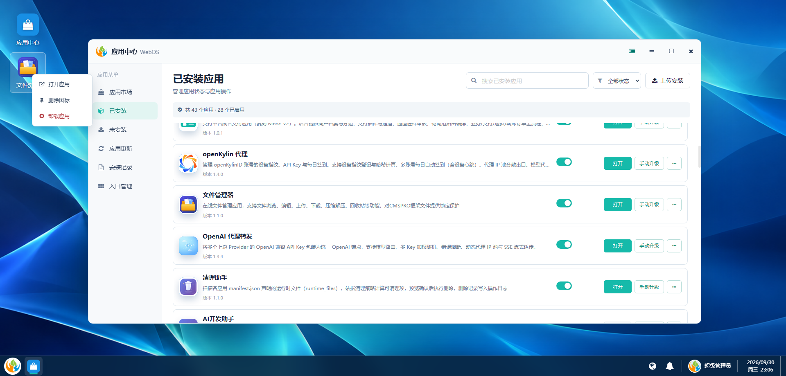
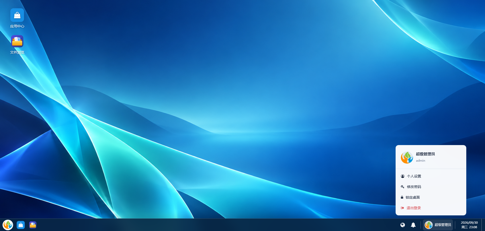

# CMSPRO WebOS 管理桌面

`cmspro.webos` 是 CmsPro v5 的桌面式后台入口应用。它复用系统现有菜单、应用市场、通知与账号接口，将后台功能组织为桌面快捷方式、开始菜单、多窗口和任务栏。

## 主要能力

- 仅从当前管理员有权访问的 `admin` 后台菜单生成开始菜单；应用按 `app_id` 聚合，系统内置菜单按文件夹聚合，不混入 `user` 和 `home` 菜单。
- “常用”根据当前管理员的打开次数和最近打开时间显示最多 6 个入口。
- 将菜单入口添加到桌面、拖动排序并按管理员持久化。
- 每个应用使用独立窗口，窗口标题显示当前应用图标，系统应用保留 CMSPRO Logo；左侧只展示该应用的菜单，菜单可收起，只有一个菜单时默认隐藏。
- 桌面快捷方式、任务栏和开始菜单统一使用应用根目录 `icon.svg`、`icon.png` 和清单 `icon` 的真实图标。
- 任务栏采用紧凑尺寸；OS 设置可按管理员调整上、下、左、右停靠位置、壁纸、时钟、界面动效和窗口默认宽高（按可用桌面区域百分比）。
- 任务栏时间随方位自适应分行，点击时间弹出可翻月与选择日期的日历面板。
- 应用市场读取远程市场图标，并与本机版本比对显示安装、已安装或更新状态。
- 已安装应用以列表展示应用信息、状态和操作，支持状态筛选、启用/禁用、打开、手动升级、导出和上传安装；更多菜单提供管理入口、备份、文档、设置和卸载。
- 在开始菜单把应用固定到桌面时，桌面入口使用应用名称。
- 桌面图标支持右键操作：打开应用、删除图标、卸载应用（应用需先禁用，系统菜单入口不提供卸载）。
- 安装应用时自动识别清单中的 `admin`、`user`、`home` 菜单，只显示实际存在的终端并分别选择顶级菜单挂载位置。
- 开始菜单底部集成锁定、退出登录和 OS 设置，并保留后台通知与账号入口；账号菜单提供个人设置（后台个人中心页）、修改密码弹窗、锁定桌面与退出登录，任务栏位置统一在 OS 设置中调整。

## 界面预览

| 桌面与日历 | 应用市场 |
| --- | --- |
|  |  |

| 已安装应用 | 未安装应用 |
| --- | --- |
|  |  |

| OS 设置 | 安装记录 |
| --- | --- |
|  |  |

| 入口管理 | 多窗口应用 |
| --- | --- |
|  |  |

| 桌面图标右键菜单 | 账号菜单 |
| --- | --- |
|  |  |

## 安装

在后台应用管理中找到“WebOS 管理桌面”，执行本地安装并启用。应用菜单默认以新窗口方式打开 `/admin/cmspro/webos`。

## 验证

```bash
php artisan test app/Apps/CmsproWebos/Tests
```

详细说明见 `doc/` 目录。
